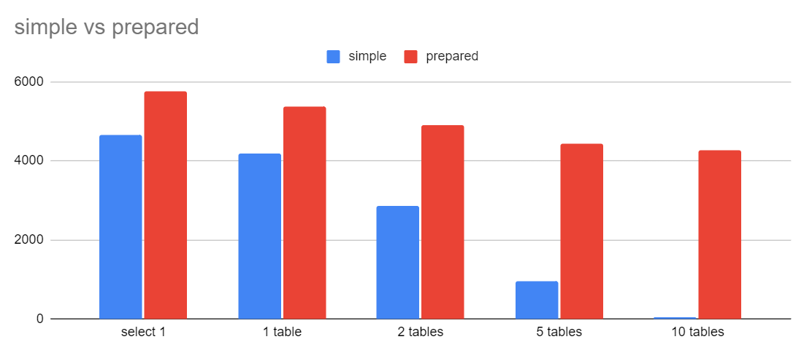

# pgbench-experiment

## Installation

```
sudo apt-get install postgresql
```

## Running

```
docker compose up postgres
```

Config:
```
export PGPASSWORD=postgres
```

Initialize Pgbench databases:

```
pgbench -h localhost -p 5433 -U postgres -d postgres -i
```

Then run the bench:

```
pgbench -h localhost -p 5433 -U postgres -d postgres
```

or via a file

```
pgbench -h localhost -p 5433 -U postgres -d postgres -M simple -f 0-select1.sql
pgbench -h localhost -p 5433 -U postgres -d postgres -M prepared -f 0-select1.sql
```

Import more data to the database:

```
docker container exec -i $(docker-compose ps -q postgres) psql -U postgres < tables.sql
```

And the full suite:
```
pgbench -h localhost -p 5433 -U postgres -d postgres -M simple -f 0-select1.sql -T 20 > results/0-simple.log
pgbench -h localhost -p 5433 -U postgres -d postgres -M prepared -f 0-select1.sql -T 20 > results/0-prepared.log

pgbench -h localhost -p 5433 -U postgres -d postgres -M simple -f 1-join1.sql -T 20 > results/1-simple.log
pgbench -h localhost -p 5433 -U postgres -d postgres -M prepared -f 1-join1.sql -T 20 > results/1-prepared.log

pgbench -h localhost -p 5433 -U postgres -d postgres -M simple -f 2-join2.sql -T 20 > results/2-simple.log
pgbench -h localhost -p 5433 -U postgres -d postgres -M prepared -f 2-join2.sql -T 20 > results/2-prepared.log

pgbench -h localhost -p 5433 -U postgres -d postgres -M simple -f 3-join5.sql -T 20 > results/3-simple.log
pgbench -h localhost -p 5433 -U postgres -d postgres -M prepared -f 3-join5.sql -T 20 > results/3-prepared.log

pgbench -h localhost -p 5433 -U postgres -d postgres -M simple -f 4-join10.sql -T 20 > results/4-simple.log
pgbench -h localhost -p 5433 -U postgres -d postgres -M prepared -f 4-join10.sql -T 20 > results/4-prepared.log
```

## Results

``````
	        simple	prepared
select 1	4657	5746
1 table	    4180	5379
2 tables	2847	4910
5 tables	942	    4420
10 tables	46	    4274
``````


